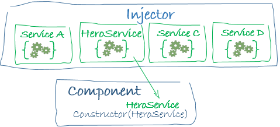

# AngularTourOfHeroes

This project was generated with [Angular CLI](https://github.com/angular/angular-cli) version 6.0.8.

## Development server

Run `ng serve` for a dev server. Navigate to `http://localhost:4200/`. The app will automatically reload if you change any of the source files.

## Code scaffolding

Run `ng generate component component-name` to generate a new component. You can also use `ng generate directive|pipe|service|class|guard|interface|enum|module`.

## Build

Run `ng build` to build the project. The build artifacts will be stored in the `dist/` directory. Use the `--prod` flag for a production build.

## Running unit tests

Run `ng test` to execute the unit tests via [Karma](https://karma-runner.github.io).

## Running end-to-end tests

Run `ng e2e` to execute the end-to-end tests via [Protractor](http://www.protractortest.org/).

## Further help

To get more help on the Angular CLI use `ng help` or go check out the [Angular CLI README](https://github.com/angular/angular-cli/blob/master/README.md).

## Learning Notes

1. Html file: double curly braces of interpolation binding of component property values

2. Decorator function: specifies Angular’s metadata for the component

* selector: the component’s CSS selector, the name of the HTML element that identifies this component within a parent component’s template

* templateUrl

* styleUrl

3. Lifecycle hook

4. Export a class and import it elsewhere

5. (Use Angular CLI to) Create a Hero class under “src/app”, and import it in HeroesComponent. Declare a Hero instance in HeroesComponent, display the instance’s properties in HeroesComponent’s HTML template. This doesn’t affect how HeroesComponent is used by its parent.

6. `<div>`, `<span>`: no special meaning, just represents its children

7. Pipe operator |: Angular ships with built-in pipes, and you can create your own. A good way to form strings, currency, dates and other display data.

    ```html
    <div>Name: {{hero.name | uppercase}}</div>
    <div>Name: <span>{{hero.name | uppercase}}</span></div>
    ```

8. Two-way data binding from ngModel in HTML: use `ngModel` that binds the hero.name component property to the data in the input box to achive the two-way data flowing.

    ```html
    <label>name:
      <input [(ngModel)]="hero.name" placeholder="name">
    </label>
    ```

    And `ngModel` belongs to the optional `FormsModule` and it isn't available by default. You have to import it in `AppModule` (`app.module.ts`).

    ```typescript
    import { FormsModule } from '@angular/forms'; // NgModel lives here

    // other critical metadata besides those in @Component decorators
    // are in @NgModule decorators
    @NgModule({

      // external modules that the app needs
      imports: [
        BrowserModule,
        FormsModule // ngModel belongs to FormsModule, is not default
      ],
    })
    ```

9. `@NgModule` decorator: app metadata live in this decorator. All components should be declared in one `NgModule`. When Angular CLI created `HeroesComponent`, it declared it in the `@NgModule` in `AppModule` (and also `AppComponent`).

10. Show a list of items: `<ul>` unordered list, `<ol>` ordered list, `<li>` list item as a child of the outer `<ul>` or `<ol>`.
  Use `*ngFor` to loop over an array:

    ```html
    <ul class="heroes"> // heroes is the component property named "property"
      <li *ngFor="let hero of heroes"> // hero represents one item in the array heroes
        <span class="badge">{{hero.id}}</span> {{hero.name}}
      </li>
    </ul>
    ```

11. Show an item conditionally: `*ngIf`

    ```html
    <div *ngIf="selectedHero"> // the component property name "selectedHero"

      <h2>{{selectedHero.name | uppercase}} Details</h2>
      <div><span>id: </span> {{selectedHero.id}}</div>
      <div>
        <label>name:
          <input [(ngModel)]="selectedHero.name" placeholder="name">
        </label>
      </div>

    </div>
    ```

12. Create a separate `hero-detail` component. This component has a `hero` property to represent the hero to show details. This is an `@Input` from its parent component (where `hero-detail` is used).

    ```typescript
    import { Component, OnInit, Input } from '@angular/core';

    @Input() hero: Hero; // @Input decorator
    ```

    In the template of the parent component, bind the `HeroesComponent.selectedHero` to `hero-detail`'s hero property:

    ```html
    <app-hero-detail [hero]="selectedHero"></app-hero-detail> 
    ```

    Angular's property binding: One-way binding from the `selectedHero` property of `HeroesComponent` to the `hero` property of `HeroDetailComponent`.

13. service: a way to share information among classes that don't know each other.

    ```typescript
    import { Injectable } from '@angular/core';

    // provides metadata for the service, like @Component()
    // by default a service is registered with the root injector
    @Injectable({
      providedIn: 'root',
    })
    export class HeroService {

      constructor() { }

    }
    ```

    The class is `@Injectable()` service, which participates in the app's **dependency injection system**.

    Inject `HeroService` into `HeroesComponent`:

    ```typescript
    constructor(private heroService: HeroService) { }
    ```

    The parameter simultaneously defines a private `heroService` property and identifies it as a `HeroService` injection site. When Angular creates a `HeroesComponent`, the **Dependency Injection system** sets the `heroService` parameter to a singleton instance of `HeroService`. This is a TypeScript [parameter property](http://www.typescriptlang.org/docs/handbook/classes.html#parameter-properties).

14. The best location to make a remote call to a server is in `ngOnInit()`, instead of `constructor()` which is suited for simple initialization.

15. Asynchronous call and `Observable`:

    In `HeroService` temporarily use `RxJS`'s `of()` method to return an `Observable<>` object:

    ```typescript
    import { Observable, of } from 'rxjs';

    getHeroes(): Observable<Hero[]> {
      return of(HEROES);
    }
    ```

    In `HeroesComponents` use the async way to get the data from the service:

    ```typescript
    getHeroes(): void {
      this.heroService.getHeroes()
          .subscribe(heroes => this.heroes = heroes);
    }
    ```

16. "Service-in-service": inject `MessageService` into `HeroService`,and then injected into `HeroesComponent`
17. If you want to bind a component property to html template, it has to be **public**.

    In `MessageComponent`:

    ```typescript
    constructor(public messageService: MessageService) {}
    ```

18. How to write the template of `MessageComponent`.

19. @NgModule: ng generate module. Router in this example is also a module (`AppRoutingModule`).

20. Set up `Routes` in `AppRoutingModule`. `Routes` tells the router which view to display when the user clicks a link or paste a URL. A typical Angular `Route` has 2 properties:

* `path`: a single string as a postfix to the root address

* `component`: the component that the router should create when navigating to this route

  ```typescript
  const routes: Route[] = [
    { path: '', component:  }
  ];
  ```

  Default route `''` that redirects to some other route:

  ```typescript
  { path: '', redirectTo: '/dashboard', pathMatch: 'full' },
  ```

  Parameterized route, `:id` is a placeholder for a special id, and `id` is a parameter in `router`, and can be used at other places:

  ```typescript
  { path: 'detail/:id', component: HeroDetailComponent }
  ```

  Initialize the router and start it listening for browser location changes by:

  ```typescript
  @NgModule({
    // supplies the service providers and directives needed for routing,
    // and performs the initial navigation based on the current browser URL
    imports: [ RouterModule.forRoot(routes) ],
  })
  ```

  In `AppComponent`, replace `<app-heroes>` with `<router-outlet>`. Remove `<app-heroes>` because heroes will only be displayed when navigated there. `<router-outlet>` tells the router where to display the routed views. The `RouterOutlet` is one of the router directives that became available to the `AppComponent` because `AppModule` imports `AppRoutingModule` which exported `RouterModule`.

21. `<nav>`: represents a part of a page that links to other pages or other part of the page. `<a>`: a hyperlink (hyper anchor) represented by its label. In this case we have the `routerLink` attribute. **(?)** The `routerLink` is the selector for the `RouterLink` directive that turns user clicks into router navigations. It's another of the public directives in the `RouterModule`.

    ```html
    <nav>
      <a routerLink="/dashboard">Dashboard</a>
      <a routerLink="/heroes">Heroes</a>
    </nav>
    ```

22. **(?)** html presents grid

    ```html
    <div class="grid grid-pad">
      <a *ngFor="let hero of heroes" class="col-1-4"
          routerLink="/detail/{{hero.id}}">
        <div class="module hero">
          <h4>{{hero.name}}</h4>
        </div>
      </a>
    </div>
    ```

    Use Angular interpolating binding for `routerLink`.

23. In `HeroDetailComponent`:
* get the id of the selected hero from the router
* get the information from `HeroService` of the selected hero and display it
* get the location of the previous page and be able to naviagate back

  ```typescript
  import { ActivatedRoute } from '@angular/router';
  import { Location } from '@angular/common';

  import { HeroService } from '../hero.service';

  // ActivatedRoute: information about the route to this instance of the HeroDetailComponent.
  //    This component is interested in the route's bag of parameters extracted from the URL.
  //    The "id" parameter is the id of the hero to display.
  // Location: an Angular service for interacting with the browser.
  //    Use it to navigate back to the view that navigated here.
  constructor(
    private route: ActivatedRoute,
    private location: Location,
    private heroService: HeroService
  ) { }

  ngOnInit() {
    this.getHero();
  }

  getHero(): void {
    // + operator converts a string to a number
    // parameters are all strings
    const id = +this.route.snapshot.paramMap.get('id');
    // create a getHero(id) method in HeroService
    this.heroService.getHero(id).subscribe(hero => this.hero = hero);
  }

  // in HTML add a button with (click)="goBack()"
  goBack(): void {
    this.location.back();
  }
  ```

24. HTTP service.... I'm too lazy to write this. See the Angular's [tutorial page](https://angular.io/tutorial/toh-pt6#enable-http-services)

25. Tell the meaning of them:

* `*ngFor`
* `{{hero.name}}`
* `(click)`
* `[hero]`
* `<app-hero-detail>`

26. Data binding:

    One-way binding:

* `{{hero.name}}`, [interpolation](https://angular.io/guide/displaying-data#interpolation): bind a component property name to the template.
* `<app-hero-detail [hero]="selectedHero"></app-hero-detail>`, property binding: pass the value of `selectedHero` from the parent component to the `hero` property of the child component.
* `(click)="selectHero(hero)"`, event binding, calls the component's `selectHero()` method when the button is clicked.

    Two-way binding:

* `<input [(ngModel)]="hero.name">`, a data property value flows to the input box from the component like **property binding**, and the changes to the input box flows back to the property value in the component as with **event binding**.

    

27. Pipe: a class with decorator `@Pipe` defines a function that transforms input values into output values for display in a view. To use `@Pipe` class in templates, use the **pipe operator (|)**. And pipes can be chained. Pipes can also take arguments to control how it performs its transformation.

28. Service and **Dependency Injection (DI)**.

    A service class has an `@Injectable` decorator. The main mechanism of DI is **injector**. The injector for the app is created by Angular during bootstrap process. The injector maintains a container of dependency instances that it has created, and reuses them if possible. For any dependency you need in your app, you must **register at least one provider with the app's injector**, so that the injector can use it to create new instances.

    Different ways to register providers:

* A service can register providers itself, in the metadata of the service (in the `@Injectable` decorator)

  ```typescript
  @Injectable({
    providedIn: 'root', // when you run ng generate service xxx, the service is registered with the root injector
  })
  ```

* Register providers in a specific `@NgModule`, and the same instance of a service is available to all components in that NgModule. Use the `providers` property of the `@NgModule` decorator:

  ```typescript
  @NgModule({
    providers: [
    BackendService,
    Logger
  ],
  ...
  })
  ```

* Register providers in a specific `@Component`, and a new instance of the service is created with each new instance of that component. Use the `providers` property of the `@Component` metadata:

  ```typescript
  @Component({
    selector:    'app-hero-list',
    templateUrl: './hero-list.component.html',
    providers:  [ HeroService ]
  })
  ```

  When Angular discovers that a component depends on a service, it first checks if the injector already has any existing instances of that service. If a requested service instance does not yet exist, the injector makes one using the **registered provider**, and adds it to the injector before returning the service to Angular.

  When all requested services have been resolved and returned, Angular can call the component's constructor with those services as arguments.

  

## Notes for Angular Routing

per https://angular.io/guide/router

1. When defining routes in the RouterModule, you can pass a `data` property to a route.

    The `data` property is a place to store arbitrary data associated with this specific route. The data property is accessible within each activated route. Use it to store items such as **page titles, breadcrumb text, and other read-only, static data**. You'll use the resolve guard to retrieve dynamic data later in the guide.

    Maybe I can change how our UI implements its breadcrumb? Dunno, need to look into this more... at least a new idea. It doesn't seem like a high priority though, the current way works fine.

    ```typescript
    const routes : Route = [
      {
        path: 'heroes',
        component: HeroListComponent,
        data: { title: 'Heroes List' }
      },
    ]
    ```

2. Now I've seen two different ways of defining routes:

* Way 1: no component if the path still has children, only including component if this is a leaf path (our project). So **each leaf path defines a complete page**.

  ```typescript
  const routes: Routes = [
    // Services
    {
      path: 'services',
      children: [
        {
          path: '',
          component: ServiceList,
        },
      ]
    },
  ```

* Way 2: including component in non-leaf paths as well. **All components on a route path construct a page from top to down.**

  ```typescript
  const crisisCenterRoutes: Routes = [
    {
      path: '',
      // The first part of the page showing without any condition
      component: CrisisCenterComponent,
      children: [
        {
          path: '',
          // The second part of the page showing without any condition
          component: CrisisListComponent,
          children: [
            {
              // The third part of the page showing if a valid id provided
              path: ':id',
              component: CrisisDetailComponent,
              canDeactivate: [CanDeactivateGuard],
              resolve: {
                crisis: CrisisDetailResolverService
              }
            },
            {
              // The third part of the page showing if no id provided
              path: '',
              component: CrisisCenterHomeComponent
            }
          ]
        }
      ]
    }
  ];
  ```

3. The `RouterOutlet` is a directive from the router library that is used like a **component**. It acts as a placeholder that marks the spot in the template where the router should display the components for that outlet. Its template selector is `<router-outlet></router-outlet>`. When the router detects the URL goes to some route defined in its RouterModule, it places its corresponding component as a sibling component to the `RouterOutlet component` (instead of replacing it).

4. After the end of each **successful navigation lifecycle**, the router builds a tree of `ActivatedRoute` objects that make up the current **state** of the router. The tree of ActivatedRoute is called [RouterState](https://angular.io/api/router/RouterState). You can access the current RouterState from anywhere in the application using the [Router](https://angular.io/api/router/Router) service and the routerState property. Each ActivatedRouter provided methods to traverse up and down the route state tree to get information from parent, child, and sibling routes.

    This means to me, only after a navigation event succeeds (finishes, and finishes without errors), the new state will be recorded into the router.

5. When setting `enableTracking` to `true` in the RouterModule, router events are logged into the console. `Router.events` provides events as observables. To filter on certain navigation events, use RxJS's `filter()` operator:

    ```typescript
    @Component({
      selector: 'app-routable',
      templateUrl: './routable.component.html',
      styleUrls: ['./routable.component.css']
    })
    export class Routable1Component implements OnInit {

      navStart: Observable<NavigationStart>;

      constructor(private router: Router) {
        // Create a new Observable that publishes only the NavigationStart event
        this.navStart = router.events.pipe(
          filter(evt => evt instanceof NavigationStart)
        ) as Observable<NavigationStart>;
      }

      ngOnInit() {
        this.navStart.subscribe(evt => console.log('Navigation Started!'));
      }
    }
    ```

6. `NavigationEnd` event happens when navigation ends successfully. `NavigationCancel` event happens when the navigation is canceled, and it is because a router guard returns false during navigation. `NavigationError` event happens when the navigation fails due to unexpected errors.

7. router guards TODO